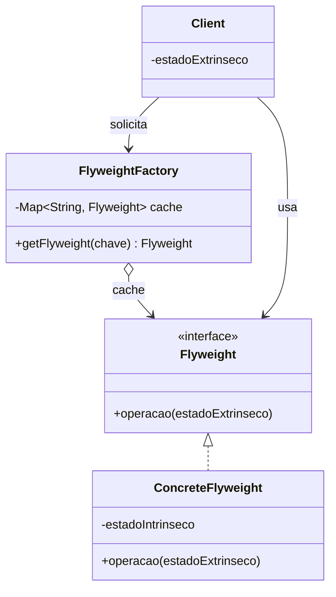
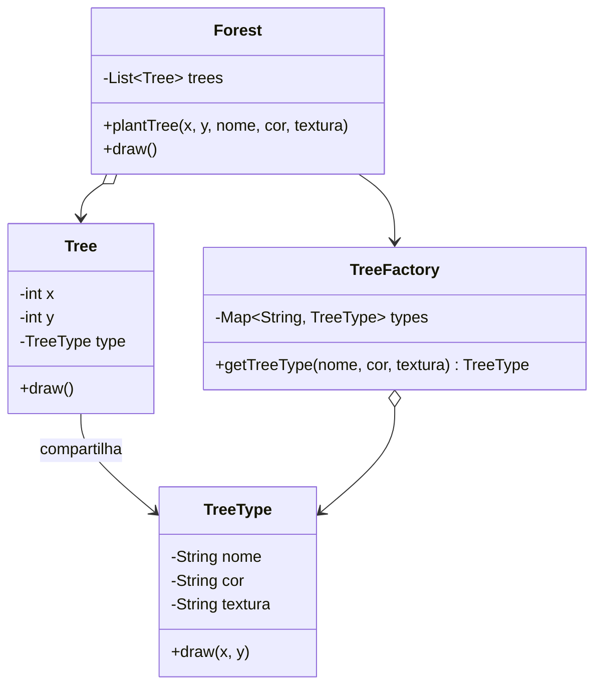

# Flyweight

**Autor:** Fabíola C Potrich
**Disciplina:** Engenharia de Software — Padrões de Projeto (Design Patterns)
**Categoria do padrão:** Estrutural (GoF)

> Repositório: [rogerioxavier/EngSW](https://github.com/rogerioxavier/EngSW/tree/main/Design-Patterns)

---

## 1. Descrição

O **Flyweight** (peso-mosca) é um padrão estrutural cuja intenção é usar
**compartilhamento** para suportar eficientemente um grande número de
objetos de granularidade fina, em vez de cada objeto guardar todos os seus
próprios dados.

A ideia central é separar o estado de um objeto em duas partes:

| Estado | O que é | Onde fica |
|---|---|---|
| **Intrínseco** | Independe do contexto, é igual em muitos objetos e é imutável | Dentro do Flyweight (compartilhado) |
| **Extrínseco** | Depende do contexto e varia de objeto para objeto | Fora do Flyweight, guardado pelo cliente e passado por parâmetro |

### Participantes

- **Flyweight** — interface com a operação que recebe o estado extrínseco.
- **ConcreteFlyweight** — implementa a interface e guarda o estado intrínseco.
- **FlyweightFactory** — cria e gerencia os flyweights, com um cache (mapa). Se um flyweight com a mesma chave já existe, devolve a instância existente; senão, cria uma nova.
- **Client** — mantém o estado extrínseco e usa a fábrica para obter os flyweights.

### Diagrama UML



Aplicado ao exemplo de código deste repositório (árvores em uma floresta):



---

## 2. Qual problema o padrão resolve?

**Problema:** uma aplicação precisa criar uma quantidade enorme de objetos
semelhantes, e isso consome memória demais (podendo até esgotá-la).

**Exemplos clássicos:**
- Um jogo com **1 milhão de árvores**: cada uma guarda malha 3D, textura,
  cor e nome — só a posição (x, y) muda de uma para outra.
- Um **editor de texto** com um objeto por caractere: fonte, tamanho e glifo
  se repetem bastante; só a posição muda.
- Sistemas de **partículas** em jogos (balas, fumaça, chuva).

**Solução:** manter uma única cópia dos dados repetidos (intrínsecos) e
passar os dados variáveis (extrínsecos) apenas quando necessário.

**Ordem de grandeza da economia (exemplo das árvores):**

| | Sem Flyweight | Com Flyweight |
|---|---|---|
| Objetos "pesados" | 1.000.000 | poucos (um por tipo de árvore) |
| Memória aproximada | ~1 GB | ~8 MB |

**Exemplo ilustrativo:** os valores de memória são uma estimativa para demonstrar a ordem de grandeza do benefício do compartilhamento. A implementação não realiza uma medição direta de memória.

**Quando usar:**
- Existe um número muito grande de objetos.
- O custo de armazenamento é alto.
- A maior parte do estado do objeto pode ser tratada como extrínseca.
- A identidade do objeto não importa (comparar dois flyweights iguais não deveria fazer diferença).

**Trade-offs:**
- ✅ Menos uso de memória.
- ❌ Mais complexidade no código (separar estado, gerenciar a fábrica).
- ❌ Possível custo extra de CPU, pois o estado extrínseco precisa ser calculado/passado a cada chamada.
- ❌ Os flyweights precisam ser **imutáveis** — se um flyweight compartilhado mudar, todos os objetos que o usam são afetados.

---

## 3. Exemplo de implementação (Java)

O código completo está em [`FlyweightDemo.java`](./FlyweightDemo.java) e pode
ser executado em qualquer IDE Java (IntelliJ, Eclipse, VS Code) ou via linha
de comando:

```bash
javac FlyweightDemo.java
java FlyweightDemo
```

Trecho central — a fábrica garante o compartilhamento:

```java
// FLYWEIGHT FACTORY
class TreeFactory {
    private static final Map<String, TreeType> types = new HashMap<>();

    static TreeType getTreeType(String nome, String cor, String textura) {
        String chave = nome + "-" + cor + "-" + textura;
        return types.computeIfAbsent(chave, k -> new TreeType(nome, cor, textura));
    }
}

// CONTEXTO: guarda apenas o estado extrínseco (x, y) + a referência ao flyweight
class Tree {
    private final int x, y;
    private final TreeType type;   // FLYWEIGHT compartilhado

    Tree(int x, int y, TreeType type) {
        this.x = x; this.y = y; this.type = type;
    }

    void draw() { type.draw(x, y); }
}
```

**Saída esperada ao rodar a demo** (100 mil árvores plantadas, só 2 tipos criados):

```
Criando novo TreeType: Pinheiro-Verde-escuro-pinheiro.png
Criando novo TreeType: Carvalho-Verde-claro-carvalho.png
Árvores plantadas: 100000
Objetos TreeType criados: 2
```

### Flyweight no próprio Java

O Java já usa Flyweight internamente:

- `Integer.valueOf(int)` faz cache de valores entre -128 e 127.
- O **String pool** — literais de string iguais compartilham a mesma instância.
- `Boolean.valueOf`, `Character.valueOf` seguem a mesma ideia.

```java
Integer a = Integer.valueOf(100), b = Integer.valueOf(100);
System.out.println(a == b); // true  (mesmo objeto, veio do cache)

Integer c = 1000, d = 1000;
System.out.println(c == d); // false (fora da faixa de cache)
```

### Padrões relacionados

- **Singleton** — a `FlyweightFactory` costuma ser implementada como um Singleton.
- **Factory Method** — a fábrica devolve instâncias compartilhadas em vez de sempre criar novas.
- **Composite** — folhas de uma árvore Composite podem ser implementadas como Flyweights.
- **State / Strategy** — objetos de estado/estratégia muitas vezes são bons candidatos a Flyweight.

---

## 4. Referências

- GAMMA, HELM, JOHNSON, VLISSIDES. *Design Patterns: Elements of Reusable Object-Oriented Software* (GoF) — capítulo sobre Flyweight.
- Refactoring Guru — [refactoring.guru/pt-br/design-patterns/flyweight](https://refactoring.guru/pt-br/design-patterns/flyweight)
- SourceMaking — [sourcemaking.com/design_patterns/flyweight](https://sourcemaking.com/design_patterns/flyweight)
- FREEMAN, Eric; ROBSON, Elisabeth. *Head First Design Patterns*.

---

## 5. Material da apresentação

Os slides usados na apresentação (5–10 min) estão em [`Flyweight.pdf`](./Flyweight.pdf).
