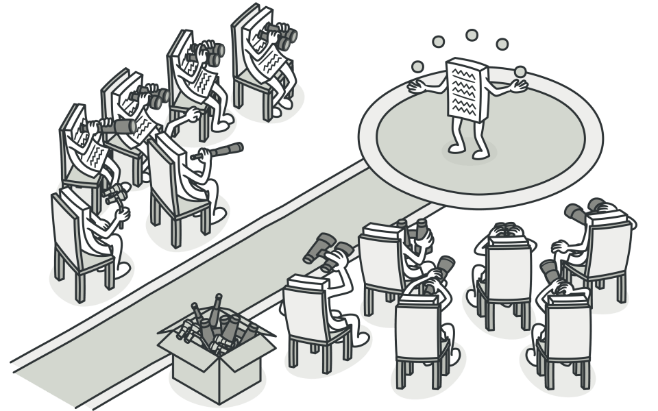

**Nome:** Observer (também conhecido como Dependents ou Publish-Subscribe).

**Categoria:** Padrão de Projeto Comportamental (Behavioral).

**Origem:** Formalizado em 1994 pelo grupo *Gang of Four* (GoF) no livro *Design Patterns*. Suas raízes, no entanto, vêm da arquitetura MVC (Model-View-Controller) da linguagem Smalltalk nos anos 70/80

---

### O Problema que Resolve

* **O Dilema:** Como informar múltiplos objetos sobre a mudança de estado de um objeto central sem criar um acoplamento forte (código rígido) ou desperdiçar processamento fazendo verificações contínuas (*polling*)?
* **A Solução Observer:** Estabelece uma relação de dependência **"um-para-muitos"**. O objeto principal avisa automaticamente todos os interessados quando seu estado muda, sem precisar saber quem eles são detalhadamente.

### Atores e Estrutura (Como funciona)

* **Subject (Sujeito / Publisher):** O objeto que detém o estado. Ele mantém uma lista de observadores e possui métodos para adicionar (*subscribe*), remover (*unsubscribe*) e notificar (*notify*) esses observadores.
* **Observer (Observador / Subscriber):** Uma interface com um método de atualização (ex: `update()`), que será chamado pelo Subject.
* **Concrete Subject e Concrete Observer:** As classes reais que implementam a regra de negócio. O *Concrete Subject* guarda o estado real, e o *Concrete Observer* executa a ação ao ser notificado.

### Especificidades Técnicas (Pontos altos para a banca)

* **Modelo Push vs. Pull:**
  * **Push:** O Subject envia todos os dados da mudança como parâmetro na notificação (maior acoplamento de dados).
  * **Pull:** O Subject apenas envia um aviso genérico de "mudei", e o Observer é responsável por ir até o Subject consultar o novo estado (menor acoplamento, mas exige mais chamadas).
* **O Problema do Lapsed Listener (Memory Leak):** É a falha mais comum ao usar este padrão. Se um Observer é destruído na aplicação, mas esquece de fazer o *unsubscribe* no Subject, o Subject continua segurando a referência dele na memória, impedindo o *Garbage Collector* de limpá-lo.
* **Efeito Cascata (Cascading Updates):** Uma notificação em um Subject pode engatilhar atualizações em Observers que, por sua vez, alteram outros Subjects, gerando reações em cadeia difíceis de rastrear e debugar.

### Vantagens (Prós)

* **Princípio Open/Closed:** Você pode introduzir novas classes de observadores sem alterar o código do Subject.
* **Baixo Acoplamento:** O Subject só sabe que o Observer implementa uma interface específica, nada mais. O código fica modular e fácil de testar.

### Desvantagens (Contras)

* A ordem em que os observadores são notificados é geralmente aleatória e não deve ser confiada pela lógica de negócio.
* Pode introduzir complexidade desnecessária se a relação entre os objetos for muito simples.

### Onde é usado no mercado (Exemplos Práticos)

* Interfaces Gráficas (UI) e Data Binding (ex: React, Vue, Angular).
* Arquitetura MVC (O *Model* é o Subject, a *View* é o Observer).
* Sistemas baseados em eventos (*Event Listeners* no JavaScript ou Java).
* Programação Reativa (RxJava, RxJS).
